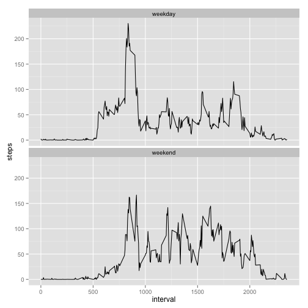

## Loading and preprocessing the data

We start by reading the csv file contained in the zip file ("activity.zip") in the working 
directory. Each row in this file contains the number of steps taken for a specific 5-minute
interval on a specific day. The dates are held as date strings which we convert into date values.
We then report the number of rows of data and the column names.


```r
data <- read.csv(unz("activity.zip", "activity.csv"), header = TRUE)
data$date <- as.Date(data$date, format = "%Y-%m-%d")
nrow(data)
```

```
## [1] 17568
```

```r
names(data)
```

```
## [1] "steps"    "date"     "interval"
```

## What is mean total number of steps taken per day?

For this part of the analysis we ignore any measurements that do not have the number of steps specified. That is, any row that has the number of steps set to NA.


```r
valid <- data[!is.na(data$steps), ]
```

Using just this subset of fully-specified data, we generate the daily total number of steps and plot 
a histogram of the number of daily steps versus the number of days at that total.


```r
dailyTotal <- tapply(valid$steps, valid$date, sum)
hist(dailyTotal, breaks = 20, main = "Histogram of total steps per day", xlab = "Total Steps", ylab = "Days")
```

 

We also calculate the mean and median number of steps per day as part of a basic summary.

```r
summary(dailyTotal)
```

```
##    Min. 1st Qu.  Median    Mean 3rd Qu.    Max. 
##      41    8841   10760   10770   13290   21190
```

## What is the average daily activity pattern?

The data cover 5-minute intervals over many days. To get a sense of average daily activity, we 
take the mean over all the days for each of the intervals and plot the average number
of steps versus the time interval. Again, only the fully-specified readings are included.


```r
avgPerInterval <- tapply(valid$steps, valid$interval, mean)
plot(names(avgPerInterval), avgPerInterval, type = "l", main = "Average steps per interval",
     xlab = "Time Interval", ylab = "Average Steps")
```

 

We then find the interval containing the maximum average and the corresponding average.


```r
maxIndex <- which.max(avgPerInterval)
maxInterval <- avgPerInterval[maxIndex]
maxInterval
```

```
##      835 
## 206.1698
```

The interval with the maximum average over the days is 835. The maximum average number of steps is 206.1698.

## Imputing missing values

Many of the readings are missing. These readings are indicated by a valid date and interval, but 
with the number of steps set to NA. We identify the missing readings and report the count.


```r
missing <- is.na(data$steps)
sum(missing)
```

```
## [1] 2304
```

Rather than simply ignoring the missing readings, we will impute values for each. 
Our approach will be to use the interval of the missing reading to look up the average value for 
all provided readings on other days for the same interval. We'll then replace the missing reading
with the corresponding interval average.

The following code makes a copy of the original data and replaces the missing values with the 
average value of the interval for data that is present.


```r
imputed <- data[,]
imputed$steps[missing] <- avgPerInterval[as.character(imputed$interval[missing])]
```

We can then do a similar analysis on the imputed data to that done on the valid subset. We generate daily totals of steps and plot a histogram of the number of steps versus the days at that value.


```r
dailyImputedTotal <- tapply(imputed$steps, imputed$date, sum)
hist(dailyImputedTotal, breaks = 20, main = "Histogram of total steps per day (with imputed values)", 
     xlab = "Total Steps", ylab = "Days")
```

 

And, as before, we calculate the mean and median number of steps per day as part of a summary.


```r
summary(dailyImputedTotal)
```

```
##    Min. 1st Qu.  Median    Mean 3rd Qu.    Max. 
##      41    9819   10770   10770   12810   21190
```

For our particular data and method for imputing missing values, the mean has stayed the same,
but the median has shifted upward slightly for the imputed data set. The change is well below 1%.

## Are there differences in activity patterns between weekdays and weekends?

To identify differences between daily behavior on weekend days versus weekdays, we first
associate a new value with each reading to distinguish it as a weekend or weekday reading.
For this part of the analysis, we use the data set with the imputed values.


```r
weekendFn <- function(date) if (weekdays(date) %in% c("Saturday", "Sunday")) "weekend" else "weekday"
imputed$weekend <- factor(sapply(imputed$date, weekendFn))
```

We then make a plot to compare the average number of steps during each 5-minute interval
for weekend days versus weekdays. 

```r
library(ggplot2)
ggplot(imputed, aes(x = interval, y = steps)) +
  stat_summary(fun.y = mean, geom = "line") +
  facet_wrap( ~ weekend, nrow = 2)
```

 
